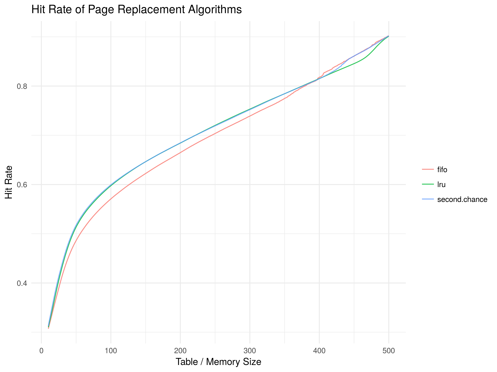

# lab4

## Building

```bash
# install rust (https://www.rust-lang.org/en-US/install.html)
# requires at least v1.26
curl https://sh.rustup.rs -sSf | sh

# compile optimized build
cargo build --release

# move to release build directory
cd target/release/
```

## Usage

```text
USAGE:
    page-replacements [FLAGS] [OPTIONS] <table_size> --algorithm <algorithm>

FLAGS:
    -h, --help       Prints help information
    -s, --stdout     Enables stdout logging for each page fault
    -V, --version    Prints version information
    -v               Sets the level of verbosity

OPTIONS:
    -a, --algorithm <algorithm>    Sets the page replacement algorithm to use
                                   [possible values: fifo, lru, second_chance, sc]
    -i, --input <input>            Input file for page file access numbers
    -o, --output <output>          Sets the output csv file to write results to
    -t, --to <to_table_size>       Sets the max page table size to test a range of sizes

ARGS:
    <table_size>    Sets the page table size
```

Simulating a range of memory sizes with `-t <to_table_size>` or `--to <to_table_size>` will use a threadpool with the same number of threads as the number of CPU cores for concurrent simulations. While multiple different simulations may be running concurrently, individual simulations are single threaded.

Using `-v` or `-s` with a range of memory size is not recommended as it may result in very slow simulations.

## Examples

```bash
# run lru with page table size of 10 & print page faults
cat accesses.txt | ./page-replacements 10 -a lru -s > output.txt

# run multiple trials with a range of memory sizes (10 to 500)
# output file will have the algorithm name inserted, output.csv -> output.fifo.csv
# the output file is truncated if it already exists
./page-replacements 10 --to 500 -i accesses.txt -a fifo -o output.csv

# run lru show debug info (prints array / page table contents for each input)
# probably not a good idea to use -v or -s with accesses.txt or large table sizes
# printing to stdout is a big bottleneck
# for second chance: blue = referenced, red = unreferenced
# multiple instances of the v flag can be used to increase log level:
# use -vv to display additional information
./page-replacements 10 -a lru -vs
```

The graph was created with R, you can run it with `Rscript`.
This requires a CSV file for each page replacement algorithm in the data directory following the file name `output.*.csv` with headers `table_size,[algorithm_name]` (Example: `table_size,lru`)

```bash
# install required R packages
$ R
> install.packages("ggplot2")
> install.packages("reshape2")
> q() # select workspace image with y

# run scripts
$ Rscript visualize.R
$ Rscript accesses.R
```

## Implementations

This program supports three different page replacement algorithms, first in first out (FIFO), least recently used (LRU), and second chance page replacement (SC). These were all implemented differently in ways to prevent unnecessary shifting in the page table.

### First In First Out (FIFO)

First in first out was the most simple to implement. Page requests were added to the table then removed in the order they were inserted. The following are the two cases when a page request is made:

1. The page does not exist in memory:

   The page is added to the "front" of the list. If memory is full, the first page inserted is removed.

2. The page exists in memory:

   No changes are made to memory.

This was implemented in with a circular queue, instead of having a specified "front" and "end" of memory, pages were replaced in a circular fashion with an incrementing position (`(index + 1) % table_size`) to prevent the need of shifting vector items.

The more simple algorithm when inserting a new page when memory is full is to remove the first element in an array or vector, shift everything afterwards over to fill in the gap, then insert the new page at the end. This is much less efficient in that each page request that results in a replacement requires shifting n items, compared to no shifting at all for a circular queue.

### Least Recently Used (LRU)

LRU is similar to FIFO in that when the page does not exist in memory, the page is added to the "front" of the list. However there were differences in which page to throw out and pages accessed that were already in memory. LRU consisted of the following two cases:

1. The page does not exist in memory:

   The page is added to the "front" of the list. If memory is full, the oldest page is removed.

2. The page exists in memory:

   Either the page is moved back to the "front" of the list, or the page's "time" is set to the current time.

Using the method of moving pages to the front of the list when the page already exists in memory caused a decent amount of overhead similar to FIFO. While it is more simple to implement, this required removing the first element, shifting all elements over, then readding the element to the front. To reduce overhead, each page is assigned a time value. When a page is to be removed, instead of shifting elements in the vector around the item page number can be simply replaced with the new one and given the next time value. A O(n) loop would have to be done to search for the page to replace / remove which would be the page with the lowest / oldest time field, though requires less than moving items around in the vector.
When a page is accessed and is in memory, the page's time value is simply set to the current time. The time used was simply a "global" incrementing counter for each insertion / access (global in the sense of all pages can use this value, but in terms of the program it is not a global variable).

### Second Chance (SC)

Second chance was an extension of FIFO conceptually, giving pages a second chance before removing them.

1. The page does not exist in memory:

   The page is added to the "front" of the list. If memory is full, check the referenced bit before removing: If 0, remove page.  If 1, reset referenced bit to 0 then move to front of list and repeat until an unreferenced page is removed.

2. The page exists in memory:

   The page's referenced "bit" is changed to 1 if previously 0. No changes if the page is already referenced.

While the implementation can be done similar to previous methods with an extension of FIFO, it would also run into the same overhead of unnecessary shifts and page removals. To work around this, the clock algorithm was used instead with the same functionality of second chance with a circular vector / array. If the memory is full and a page request results in a page fault, the memory is looped until a page is found with the referenced bit set to 0 (or the reference bool set to false in this case) while resetting any pages that are referenced. The found page is then replaced with the new page request. If the page request refers to a page already in memory, the page's referenced bit / bool is simply set to 1 / true.

## Results

Hit Rate Overview

| Table Size | FIFO    | LRU     | Second Chance |
| ---------- | ------- | ------- | ------------- |
| 10         | 0.30695 | 0.31015 | 0.31272       |
| 50         | 0.48611 | 0.51362 | 0.51742       |
| 100        | 0.57079 | 0.59756 | 0.59930       |
| 200        | 0.66477 | 0.68420 | 0.68450       |
| 500        | 0.90212 | 0.90128 | 0.90198       |

The three page replacement algorithms were tested with the given `accesses.txt` file for table sizes 10 to 500. From the table above of partial hit rate data, we can see that second chance produced the highest hit rates. LRU was very close, though lost to second chance by a very small amount. FIFO was the worst paging algorithm, though when it reached larger memory sizes (around 400), it was also very close. The full data for the range of memory sizes from 10 to 500 are in [`data/algorithm_data.csv`](data/algorithm_data.csv) and shown below visually in the plot.



After the table sizes were tested above 400, the different algorithms start to deviate with FIFO briefly having higher hit rates and LRU having the lowest. This may have been caused by the specific data given. However, it also can show that with a large enough memory size, FIFO can still perform relatively well. There were a total of 625 unique page requests (found with the command `sort accesses.txt | uniq -c | wc -l`), and a select few pages that were constantly being requested as shown in the plot below.


While this plot does not display when these page requests are made, we can see why FIFO was inferior to the other two page replacement algorithms as it would remove pages regardless of how much they were used. Since some pages were used over 150,000 times compared to most of the pages being requested below 12,500 times, these pages would have benefited most from LRU and second chance.

In the data found from simulations with the given page accesses file, second chance was the best page replacement algorithm by a very marginal amount compared to LRU, and by slightly larger amount with memory sizes around 425 to 475 pages. This, however, is potential to change depending on which and how the pages are accessed, how often and in what order each page is accessed. To find a more generalized result, a bigger number of page request sets can be used and an average can be found. Currently, the data provided is essentially a sample size of 1 so conclusions can only be drawn with this specific data.