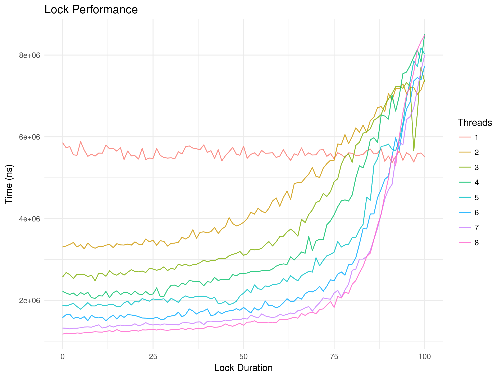

# Final Lab

## Overhead of synchronization primitives (Mutex)

When dealing with synchronization requirements, there is additional code and processing to be done to maintain mutual exclusion. Because of this, the overhead of such code may be considered. However, lock contention in certain cases may have a much bigger impact that makes overhead of locks negligible.

# Testing

To figure out what the raw overhead of a mutex was, a set of benchmarks were made. In this case, only mutual exclusions were tested as other synchronization primitives such as reader-writer locks would be similar (for writers as there can be only a single writer at any given time). Using Rust as the programming language, in order to safely use a mutex, it would need to be `Arc<Mutex>` type. An `Arc<T>` is a reference counting pointer, "Arc" standing for "atomically reference counted." This allows for thread safe data to be both sent and shared across different threads due to the atomic operations, and reference counting in order to know when the data T in Arc<T> should be destroyed (when the last Arc pointer is destroyed). Mutex<T> is a Send type safe to send across threads and Arc<T> is a Sync type safe to share across threads. Because of this, there is both the added overhead of the mutual exclusion itself and the reference-counting pointer.

# Results

`Arc<T>` was compared with `Cell<T>`, which is similar to a simple pointer type. The following table shows the time per iteration for different data types. Each benchmark looped from 0 to 1,000,000 incrementing the inner data type by 1 each iteration. This loop is then repeated for at least 301 times and the average is returned. The resulting average is then divided by 1,000,000 to find the iteration time for an individual u64 increment, required locks and references.

| `Cell<u64>`     | `Arc<u64>`       | `Mutex<u64>`      | `Arc<Mutex<u64>>` |
| --------------- | ---------------- | ----------------- | ----------------- |
| 0.29435 ns/iter | 1.767729 ns/iter | 19.981289 ns/iter | 20.871628 ns/iter |

While above shows that there is a clear overhead for the `Mutex<T>` type and a smaller one for `Arc<T>`. However, when we start to use the `Arc<Mutex<T>>` type across threads, it becomes clear that in certain cases there is much more overhead caused by lock contention compared to the Mutex itself.

Another set of benchmarks were made to test the efficiency of locks. A set of threads were spawned with a number of work "units." Each thread processed a percentage of units generated a random number and were done for random amounts / durations, both with the mutex unlocked and locked.

The following plot shows the results of the variables tested:

* Thread count (1 to 8)
* Lock percentage (0% to 100%)

Percentages were not constant to allow for randomness in lock contention. For example: at 50%, the number of units to be done with the lock acquired were random amounts from 0 to 50% of total units tested. Each benchmark was done with 1,000,000 total units to test to allow for enough lock contention to occur so that the differences can be seen. Same as before, each benchmark was also run for at least 301 times to find the average.

# Conclusion

While with lots of variation, the plot above shows that single threaded work produced a relatively constant performance independent from how long the lock was acquired which is expected as there would be no waiting on other threads. With low percentages of lock durations, the introduction of more threads allows for better performance due to parallel processing of the work units spread across multiple CPU cores. However, as the duration of locks increased, the graph clearly shows (albeit a bit messy) that performance quickly becomes degraded. While single threaded work produced the same performance, the multi threaded work became much slower, seemingly increasingly slow as the number of threads increased.

While there may be some overhead for synchronization primitives, they quickly become negligible in some workloads due to lock contention. When dealing with multithreaded programs and locks the focus should not be entirely on overhead of locks, but rather minimizing the amount of lock contention and unnecessary waiting or blocking.
