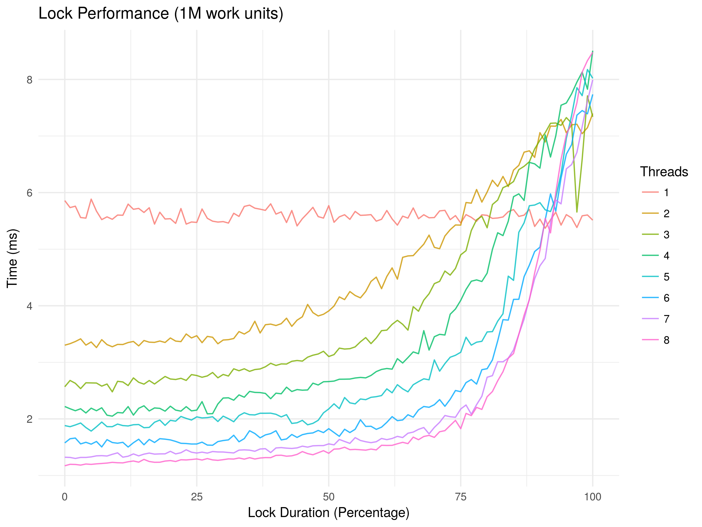

# Final Lab

## Overhead of synchronization primitives (Mutex)

When using mutexes, the overhead may be considered. However, lock contention has a much bigger impact that makes lock overhead negligible.

http://preshing.com/20111118/locks-arent-slow-lock-contention-is/